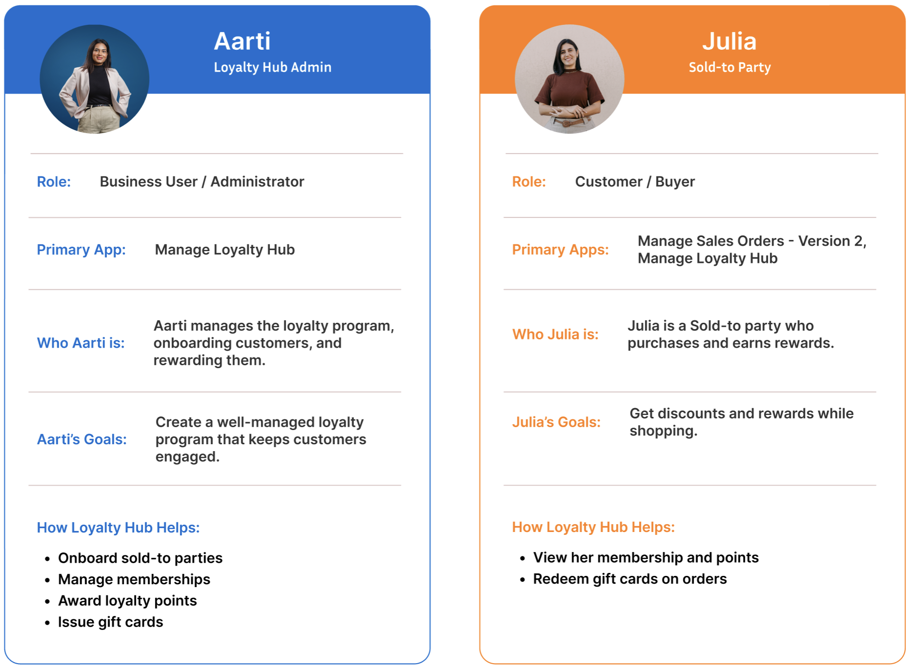
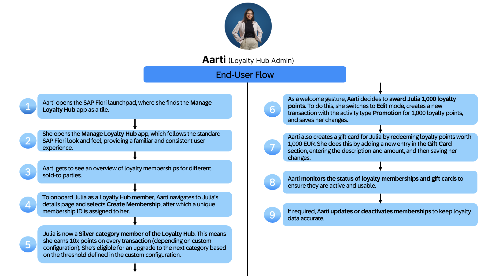
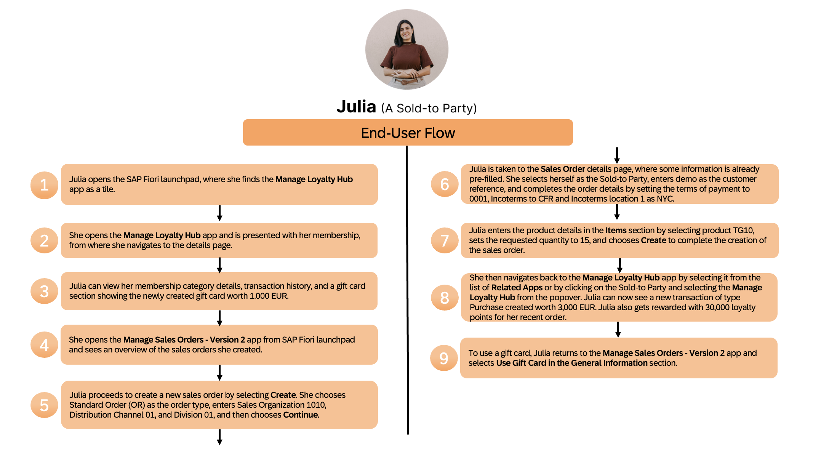
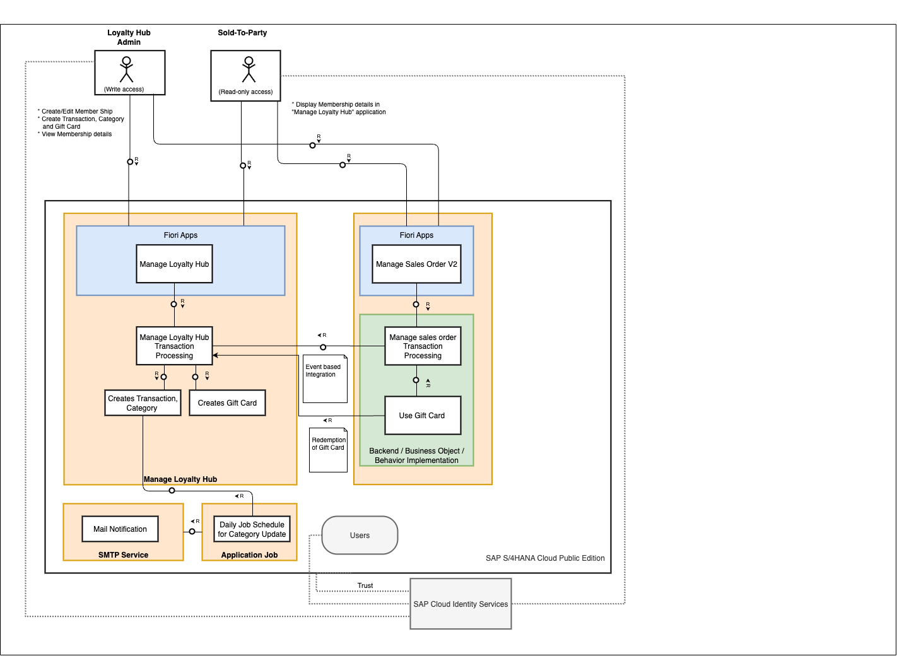
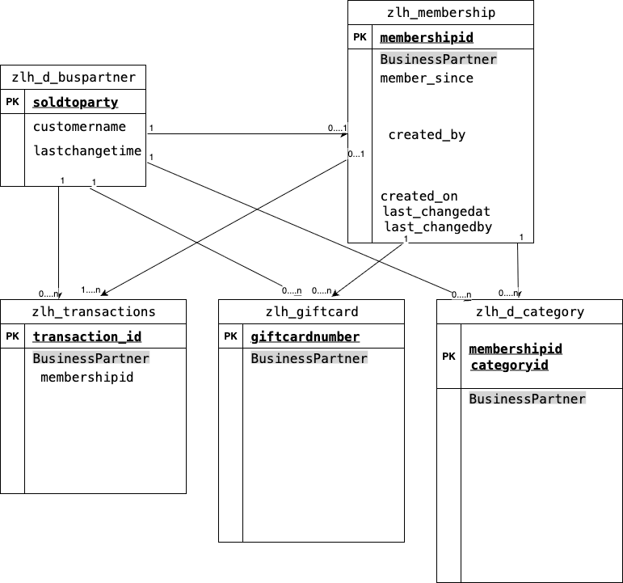

# On-Stack Partner Reference Application 'Loyalty Hub'

## Description

The **Partner Reference Application** is a reference implementation that provides clear guidance on the golden path for partners. It is built as an **on-stack extension on SAP S/4HANA Cloud Public Edition**, demonstrating how to extend core business processes while adhering to SAP’s clean-core principles.

This application is integrated with [**Manage Sales Orders – Version 2**](https://fioriappslibrary.hana.ondemand.com/sap/fix/externalViewer/#/detail/Apps('F3893')/S36), a standard SAP Fiori application, enabling simple, transparent, and event-driven loyalty program management for customers. It showcases how standard SAP business processes can be enhanced without modifying the core.

The repository includes the **Loyalty Hub** application as a ready-to-run reference implementation. It also provides detailed, step-by-step tutorials to build, run, and deploy the application from scratch using an incremental development approach.

This tutorial covers how to **build, run, and integrate applications using the ABAP RESTful Application Programming Model (RAP).** The application architecture enables partners to deliver a multi-off (customer-specific) on-stack extension for SAP S/4HANA Cloud Public Edition consumers, ensuring seamless integration, scalability, and upgrade stability.

By leveraging the SAP S/4HANA Cloud Public Edition on-stack extensibility and the ABAP RAP model, the application aligns with SAP’s standards for enterprise-grade business solutions. It delivers a consistent and harmonized user experience along with robust and secure integration capabilities, including:

- A pre-built RAP application in the Z namespace for faster partner onboarding
- Step-by-step code walkthroughs to support learning and implementation
- Implementation based on SAP RAP standards and best practices
- A clean-core architecture that ensures upgrade safety and independent lifecycle management
- An on-stack extension tightly integrated with **Manage Sales Orders – Version 2** using ABAP RAP for efficient and extensible design
- Secure, reliable, and future-ready integration with SAP S/4HANA Cloud Public Edition

### About the Sample Application *Loyalty Hub*
Imagine you're responsible for managing customer loyalty within SAP S/4HANA Cloud Public Edition and your goal is to reward repeat customers and encourage long-term engagement using memberships, loyalty points, and gift cards. 

In this scenario, Aarti, a loyalty administrator, manages memberships, awards loyalty points, and issues gift cards. Julia, a customer, earns and redeems rewards during sales transactions. The image below outlines their roles, goals, and interactions with the **Loyalty Hub** application.

    

The image below illustrates the end-to-end user flow for **Aarti**, the Loyalty Hub administrator. It shows how she navigates the **Loyalty Hub** application to onboard sold-to parties and manage their memberships.

    

The image below illustrates the end-to-end user flow for **Julia**, the Sold-to Party. It shows how she navigates from the **Manage Sales Orders – Version 2** application to the **Loyalty Hub** application to view membership points, redeem points for gift cards, and apply gift cards to sales orders.

    

### Key Features

The **Loyalty Hub** application offers the following key features and capabilities:

- Seamless integration with the **Manage Sales Orders – Version 2** application.
- End-to-end management of memberships, categories, transactions, and gift card redemption.
- Built-in email notification services to inform customers when their membership category is upgraded.
- Background job execution to automatically evaluate and promote membership categories based on defined criteria.

Key strategies and tools for developing the application are:

- Develop and manage ABAP applications using ABAP development tools for Eclipse (ADT).
- Leverage a modern web architecture with SAP Fiori for user experience, ABAP for business logic, and SAP HANA Cloud for high-performance data processing.
- Apply model-driven development using ABAP RAP, Core Data Services (CDS), and SAP Fiori elements.
- Provide an SAP standard user experience with predefined floor plans, theming options, and personalization features.
- Enable multi-step data changes using the draft concept, allowing users to save incomplete changes before final submission.
- Ensure enterprise-grade security with SAP-standard authentication and role-based authorizations.
- Deploy the application as on-stack extensions with multi-off delivery.

## Architecture and User Interaction Flow

The diagram below illustrates the end-to-end architecture and user interaction flow of the **Loyalty Hub** application integrated with the **Manage Sales Orders – Version 2** application in SAP S/4HANA Cloud Public Edition. It shows how administrators and sold-to parties interact with SAP Fiori apps, back-end business objects, event-based integrations, background jobs, and email notifications within a secure SAP standard landscape.

    

## Entity Relationship Diagram

The diagram below represents the **Loyalty Hub** data model, showing core entities such as business partners, memberships, transactions, gift cards, and categories along with their relationships. It highlights how a sold-to party is linked to a membership and how that membership drives related transactions, gift cards, and category assignments.

    

## Requirements

The application is based on SAP S/4HANA Cloud Public Edition. Here's what you need:

- **Eclipse with ABAP Development Tools (ADT)** – This is used for back-end development and ABAP RAP modeling.
- An **SAP BTP account**, which includes SAP Business Application Studio as a standardized development environment.
- **GitHub Repository** – Use this repository to manage source code versioning and collaboration.
- **SAP S/4HANA Cloud Public Edition** – This acts as the digital core, providing business processes and data integration.

## Overview

If you prefer a quick start with a deployment of the **Loyalty Hub** application including all features without further explanation, follow the [quick start guide](./Tutorials/10_Quick_Start_Guide.md).

## Tutorials

1. Develop the core application focusing on business models, business logic, and UI:
   
    1. [Prepare Your SAP BTP Account and SAP BAS for UI Extension](./Tutorials/11_Prepare_BTP_Account_BAS.md)
    2. [Business Configuation Maintenence Object for Maintaining Categories](./Tutorials/12_Business_configuration_maintenance_object.md)
    3. [Developing RAP Applications - Data Modeling and OData Service Generation](./Tutorials/13_Develop_ABAP_RAP_Application.md)
    4. [Developing Business Logic](./Tutorials/14_Develop_Business_Logic.md)
    5. [Add Authentication and Role-Based Authorization](./Tutorials/16_AuthorizationObject_IAM_Roles.md)
    6. [Core Data Services](./Tutorials/15_Core_Data_Services.md)
    7. [Message Handling](./Tutorials/17_Message_Handling.md)
   
 2. Integration and gift card extension
    1. [Sales Order Integration with Loyalty Hub](./Tutorials/20_Event_Based_Integration.md)
    2. [Sales Order Gift Card Extension](./Tutorials/21_extending_sales_order_giftcard_scenario.md)
 3. Custome UI extention navigation
    1. [Extending the User Interface of the Application Using Freestyle SAPUI5 or SAP Fiori Elements](./Tutorials/30_Extend_User_Interface.md)
    2. [Navigation Links and Semantic Actions](./Tutorials/31_navigation.md)
 4. [Resuse Services and Other Features](./Tutorials/40_Reuse_Services.md)
    1. [Number Range](./Tutorials/41_NumberRange.md)
    2. [Application Job for Category Upgrade](./Tutorials/42_Application_Job_Category_Update.md)
    3. [Email Notification on Category Upgrade](./Tutorials/43_Email_Notification_Category_Update.md)
    4. [Message Logging for Application Job](./Tutorials/44_LogObject.md)
   
## Known Issues

There aren't any known issues.

## Get Support

This repository is provided "as-is", we don't offer support. For questions and comments, [join the SAP Community](https://answers.sap.com/questions/ask.html).

## License

Copyright (c) 2026 SAP SE or an SAP affiliate company. All rights reserved. This project is licensed under the Apache Software License, version 2.0 except as noted otherwise in the [LICENSE](./LICENSE) file.

## Disclaimer

This repository contains sample code provided “as‑is” for instructional purposes only. SAP makes no warranties and accepts no liability, except in cases of gross negligence or willful misconduct. All included data is fictitious and contains no real personal, confidential, or sensitive information. Do not use this tutorial app productively with real personal data. SAP is not responsible if anyone uses it to capture personal data.
