# Prepare Your SAP BTP Account and SAP BAS for UI extension

## Overview

This tutorial explains how to create a subaccount in an SAP Business Technology Platform (SAP BTP) global account. It also covers how to enable SAP Business Application Studio in the subaccount, create a project in SAP Build, and set up an HTTP destination from the subaccount to an SAP S/4HANA Cloud Public Edition system.

## Prerequisites

To start with this tutorial, you need an SAP BTP global account.

## Set Up Your SAP BTP Subaccount

### Create Your Subaccount

1. Go to your SAP BTP global account cockpit.
2. Create a new multi-environment subaccount called `LoyaltyHub` and choose a region and service provider.

    > Refer to the official [SAP regions and API endpoints for the ABAP environment](https://help.sap.com/docs/sap-btp-abap-environment/abap-environment/regions-and-api-endpoints-for-abap-environment?locale=en-US) to choose the appropriate region and service provider for your ABAP environment.

    > The subdomain must be unique across the whole region. Include an abbreviation that uniquely identifies your company. Don't use special characters or capital letters. Keep it short to avoid length restriction issues.

### Enable SAP Business Application Studio

SAP Business Application Studio (BAS) is a powerful web-based development environment used for building the frontend of SAP Fiori applications. It offers comprehensive tools for designing, developing, and customizing user interfaces based on SAP Fiori design principles, enabling seamless integration with backend services and enhancing the overall user experience.

If you already have **entitlements** for SAP BAS and have completed the setup using the booster, your subscription is already active. Otherwise, in your newly created SAP BTP subaccount, only the default services appear under **Entitlements**. In this case, you need to configure the setup manually by following these steps:

1. Go to the SAP BTP global account.
2. Go to **Entitlements > Entity Assignments**.

    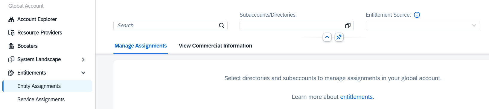

3. Open the value help under **Subaccount/Directories** and select the corresponding SAP BTP subaccount, for example `LoyaltyHub`.

    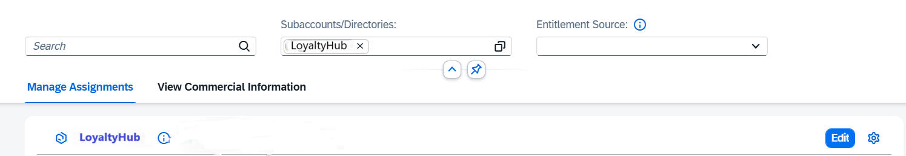

4. Choose **Edit** and then choose **Add Service Plans**.

    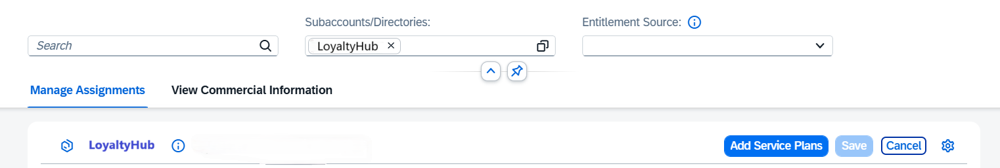

5. Select the **SAP Build Code** entitlement and choose **standard(Application)**.

    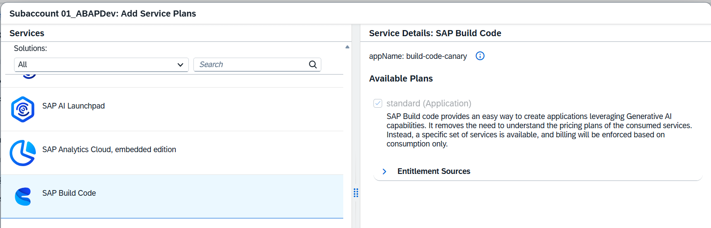

6. Go back to your SAP BTP subaccount. Check if SAP BAS is available in the **Entitlements** list.
7. To create an instance of this service within the SAP BTP subaccount, go to Service Marketplace. In the list, select **SAP Build Code** and choose **Create**. The instance appears in the subscriptions list.
8. Go to **Security and Users** to assign user roles to this service instance. 
    > **Note**: When you start the app for the first time, access is denied because user roles haven't been assigned to this service instance yet.
9. Select your user and go to the assigned role collections.
10. Select all role collections of SAP BAS and confirm the assignment. Three role collections are added to your user.
11. Start SAP BAS. If access is denied, wait a few seconds and try again. You may need to clear your browser cache.
12. After you've started the development environment, create a new dev space for the development of this tutorial. Name it `LoyaltyHub` and select **SAP Fiori**.

You've now successfully set up your SAP BTP subaccount and enabled SAP BAS.

### Create a Project in SAP Build

1. Go to your SAP BTP global account cockpit.
2. Open the subaccount created, for example `LoyaltyHub`.
3. Choose **Instances and Subscriptions > SAP Business Application Studio**.
4. From the SAP Build page, choose **Create > Clone from Git**.

    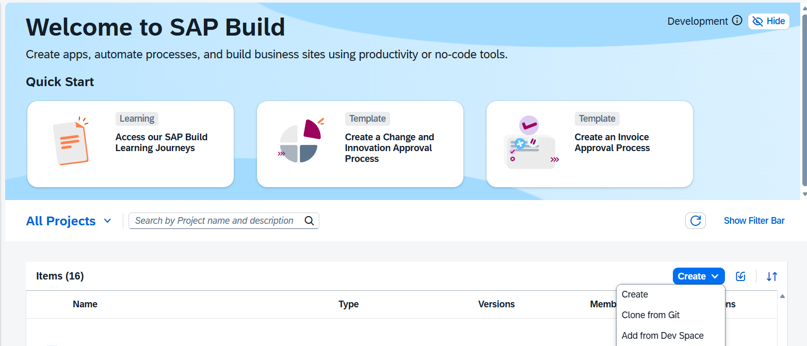

5. Select **SAP Fiori Application** and choose **Next**.

    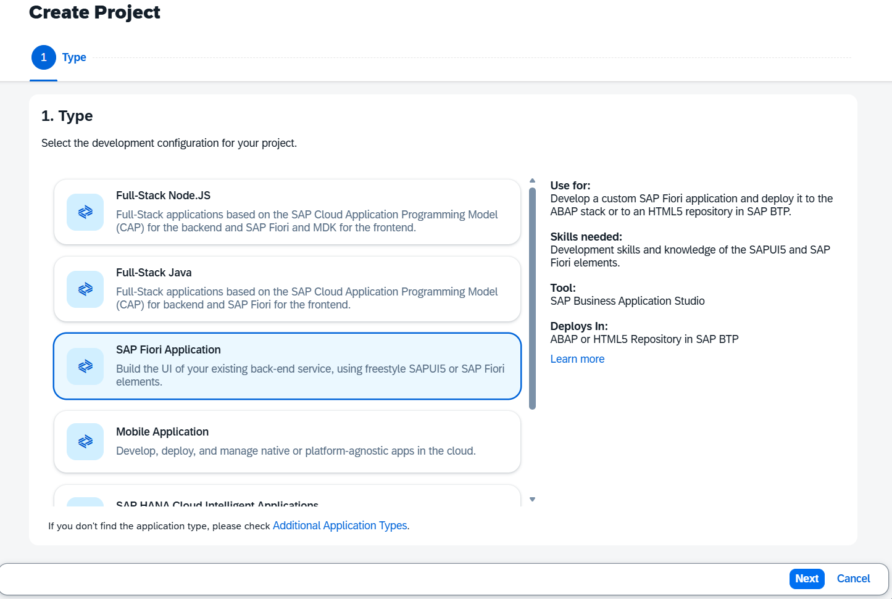

6. Under **Clone from Git**, provide your Git URL. Enter a name for the project.

    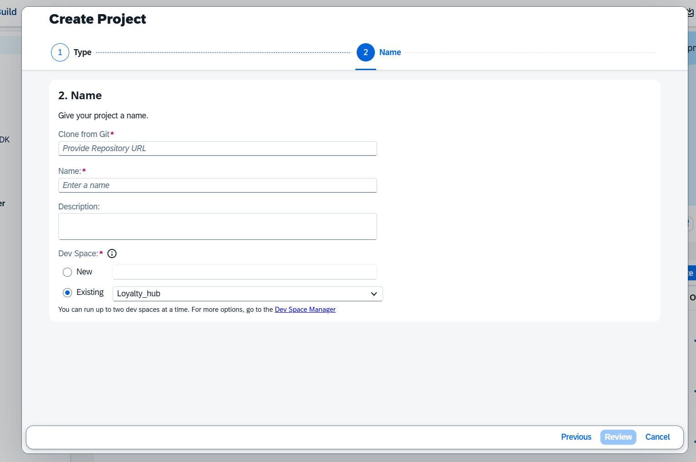

7. Choose an existing dev space or create a new one.
8. Choose **Create**.
9. SAP BAS opens in a new tab and requests your credentials for the GitHub repository. Provide the username and token of your repository and choose **Ok**.

    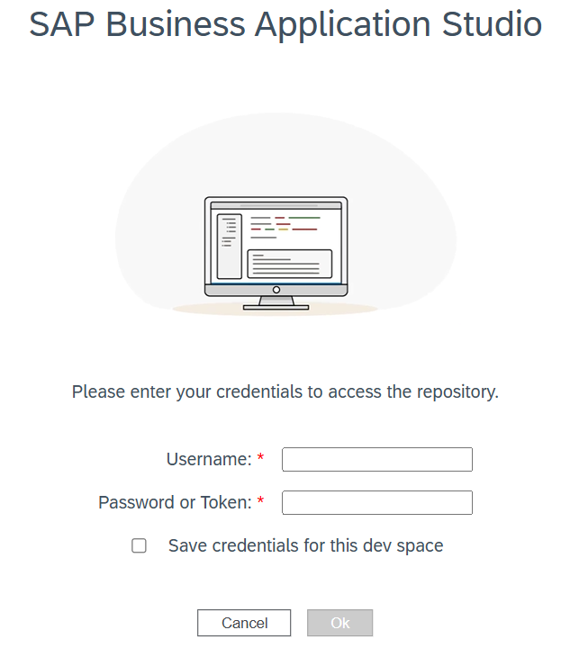

### Create HTTP Destination to SAP S/4HANA Cloud Public Edition System

The Destination service lets you find the information that is required to access a remote service or system from your cloud application.
1. Go to your SAP BTP global account cockpit.
2. Open the subaccount you've created, for example `LoyaltyHub`.
3. Choose **Connectivity > Destinations**.
4. Choose **Create**. In the **Create New Destination** dialog, select **From Scratch** and choose **Create**.

    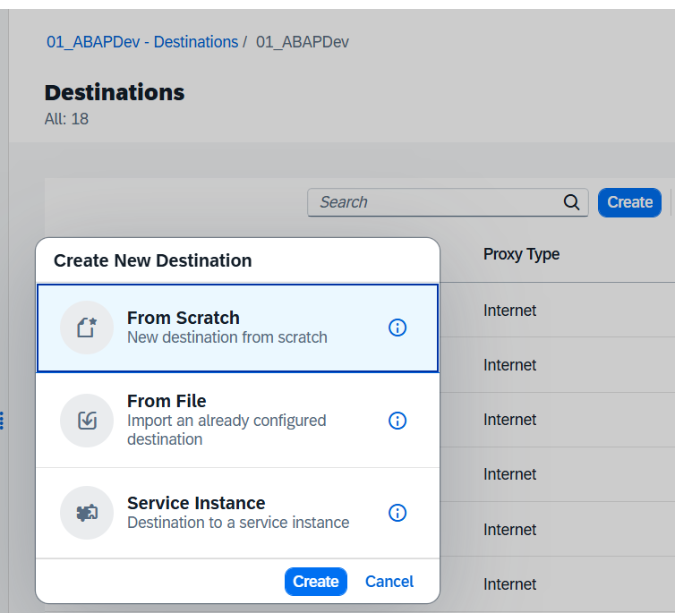

5. In the **Destination Details** section, enter the following details.
    - **Name**: Enter a name for the destination.
    - **Type**: From the dropdown menu, select `HTTP`.
    - Provide a description for the destination. This is an optional field.
    - **Proxy Type**: From the dropdown menu, select `Internet`.
    - **URL**: Specify the destination URL. Make sure to use the API endpoint of the SAP S/4HANA Cloud Public Edition system (…-api.s4hana…) in the URL field.
    - **Authentication**: From the dropdown menu, select `SAMLAssertion`.

    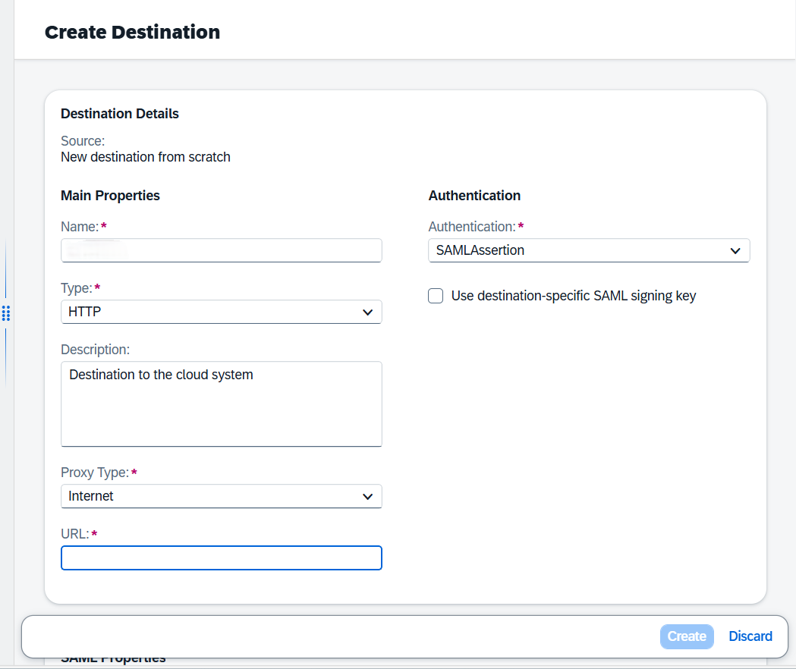

6. Under **Client Trust Store configuration** keep **Use default client trust store** as checked.
6. Under the **SAML Properties** section provide the following values:
    - **AuthnContextClassRef**: urn:oasis:names:tc:SAML:2.0:ac:classes:PreviousSession​.
    - **Audience:** System URL.
    - **Name Id Format**: urn:oasis:names:tc:SAML:1.1:nameid-format:emailAddress.

    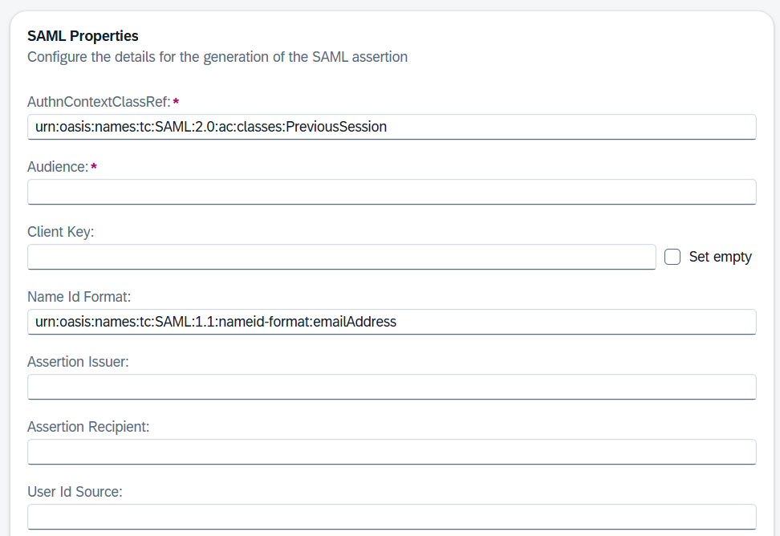

13. Add the following **Additional Properties**.
    | Key                      | Value                                |
    | ------------------------ | ------------------------------------ |
    | HTML5.DynamicDestination | true                                 |
    | HTML5.Timeout            | 60000                                |
    | WebIDEEnabled            | true                                 |
    | WebIDEUsage              | odata_abap,ui5_execute_abap,dev_abap |

    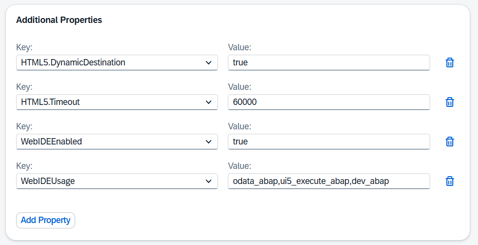

14. Then click on **Create**.
15. Click on **Destination Trust** (choose **Connectivity > Destinations Trust**).
16. Click on **Export**.
17. Open the Fiori launchpad of your SAP S/4HANA Cloud Public Edition system..
18. Open **Communication Systems** app and click on **New**, and provide **system ID**.

    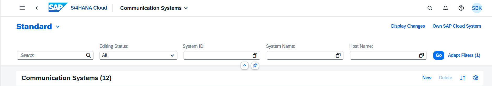

19. Provide a **system ID**.
20. As **Technical Data**, set **Inbound Only**.
21. Under **Identity Provider**, switch on **SAML Bearer Assertion Provider**.
22. Choose **Upload Signing Certificate** and upload the previously downloaded **Destination Trust** file.
23. Manually copy the **CN value** (value after CN=) from **Signing Certificate Subject** and add it to **SAML Bearer Issuer**.
