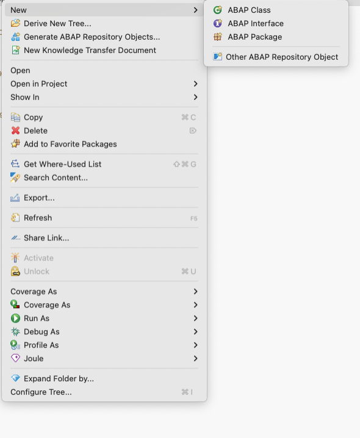
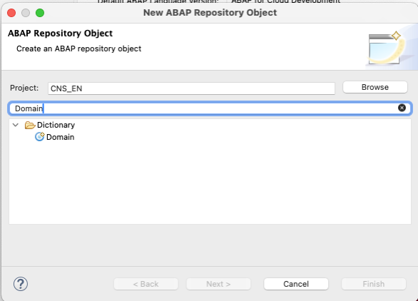
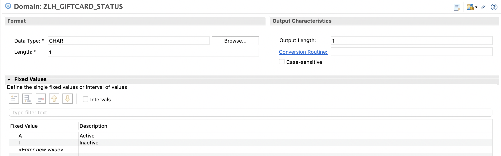
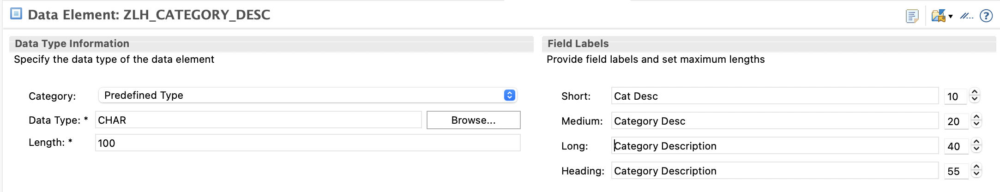
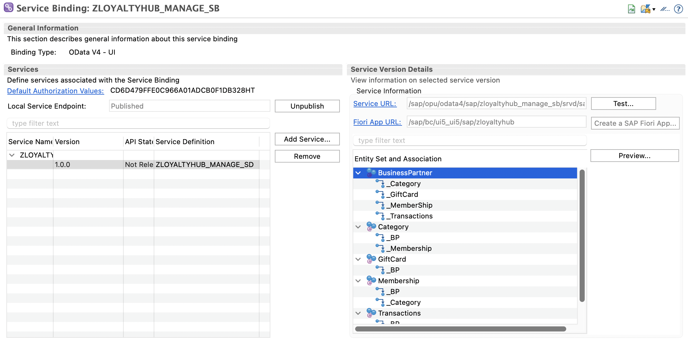
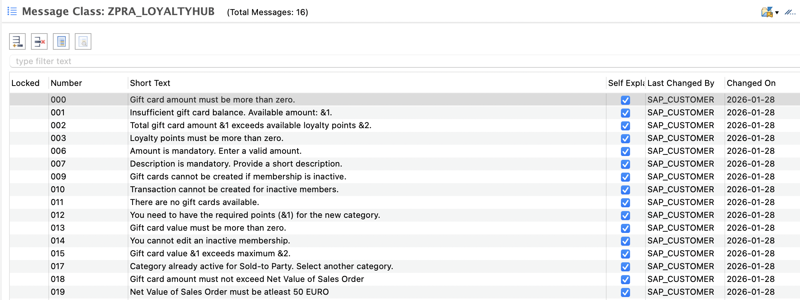

# Developing RAP Applications

## Overview

 The high-level diagram below illustrates the end-to-end development process using the ABAP RESTful Application Programming Model (RAP). This process starts from defining the data model using CDS entities. It then moves through behavior and service exposure layers. Finally, it culminates in a SAP Fiori elements UI. This approach enables rapid, metadata-driven enterprise application development.

                                                          [Database]
                                                              ↓
                                                         [CDS Entity]
                                                              ↓ 
                                                 [Behavior Definition + Class]
                                                              ↓
                                                     [Service Definition]
                                                              ↓
                                                      [OData V4 Binding]
                                                              ↓
                                                    [SAP Fiori Elements UI]

Before you can create an ABAP RAP application, you need to create the following artifacts:

1. Package

      - A logical container used to organize development objects (CDS views, classes, services, etc.).
      - Helps with transport management and modular design.

2. Database (DB) Tables

      - Physical tables in the ABAP Dictionary that persist data. In RAP or CAP, you define data models through CDS views that map to underlying tables.
      - Types of DB tables:
         - Transparent tables
         - Views and CDS views: These provide logical representations of DB tables.

3. Source Code Library

     - Libraries that can be shared across packages or projects. They are collections of reusable ABAP code, such as:
         - Classes
         - Function groups
         - Interfaces

4. Transactional UI Services

   - SAP Fiori apps or UI services that allow users to perform business transactions (create, update, delete). In RAP, they are created using service definitions and service bindings (OData V4).
   - It automatically supports:
      - Draft handling
      - Validation and determinations
      - Actions, such as approve or submit
   - It can be launched through:
      - SAP Fiori launchpad
      - SAP Build Work Zone
      - Integrated into SAP S/4HANA Fiori catalogs/groups
5. Message Class

    - Used to define and manage standardized messages (errors, warnings, information). They are used in exception handling, UI messages, or API responses.
    - Example: ZMSG001, with entries like:
      - 001: Customer does not exist.
      - 002: Order has already been approved.

Let's look into it in detail:

## Create a Package

Before creating the DB table, you need to create a package that holds all the application metadata.

1. In ADT, go to the Project Explorer, right-click on the **ZPARTNER** software component package and choose **New > ABAP Package**.
2. Maintain the required information:
   - **Name**: ZPRA_LOYALTYHUB
   - **Description**: Loyalty Hub: On-Stack Partner Reference Application
3. Choose **Next**. The system asks for the application component. You can skip this if you don't know it.
4. Choose **Next**. A dialog box requesting the transport request is displayed.
   - If there is an existing transport request, select that transport request and choose **Finish**.
   - If there is no existing transport request, choose **Create New Request** and enter a description, for example Loyalty Hub Application, and choose **Finish**.

## Database Table

A database table is a structured object used to store persistent data in the underlying SAP HANA database, similar to how tables work in traditional ABAP on-premise systems but with some modern cloud-specific approaches.

A database table requires that the attributes are defined in the table. Each attribute requires a type, such as data types or domains, based on the requirements. Let's first explore how to define these attributes, followed by the process of creating the database table.

### Domains

A domain is a data type definition used in the ABAP Dictionary to define the technical attributes (such as data type, length, and value range) of a field that is reused across multiple data elements or tables.

#### Create a Domain

  1. Select the package where the domain needs to be created in, for example **ZPRA_LOYALTYHUB**.
  2. Right-click on the package and choose **New > Other ABAP Repository Object**.

       

  3. Search for Domain and select it. Choose **Next**.

      

  4. Enter the following information:
      - **Name**: ZLH_GIFTCARD_STATUS
      - **Description**: Gift Card Status
  5. Choose **Next** and select a transport request (either a new or an existing one).
  6. Choose **Finish**.

  7. Select the domain to enter the FIXED values below:

        | Fixed Values | Description |
        |:---:|:---:|
        | A   | Active     |
        | I   | Inactive   |

  8. Additionally, set the **Data Type** as *CHAR*.

      

The **ZLH_GIFTCARD_STATUS** domain is created and can be used in data elements.
Similarly, create other domains for the entire application. [Here](../objects/DOMA) is the list of the domains used in the **Loyalty Hub** application.

### Data Elements

A data element is a semantic layer of the data type definition in the ABAP Dictionary. It builds on top of a domain (or directly defines a type) and provides:

1. Meaningful descriptions (short, medium, long text labels)
2. Field labels for UI and metadata
3. Connection to domain (for technical details)

#### Create a Data Element

   1. Select the package where the data element needs to be created, for example **ZPRA_LOYALTYHUB**.
   2. Right-click on Dictionary and choose **New > Data Elements**.
   3. Enter the following information:
      - **Name**: ZLH_CATEGORY_DESC
      - **Description**: Category Description
   4. Choose **Next** and select a transport request (either a new or an existing one).
   5. Choose **Finish**.
   6. Open the data element you've created and set the following values:
      - **Category**: Predefined Type
      - **Data Type**: CHAR
      - **Field Labels**: Category Description

          

The **ZLH_CATEGORY_DESC** data element is created and can be used in DB tables.
Similarly, create other data elements for the entire application. [Here](../objects/DTEL) is the list of the data elements used in the **Loyalty Hub** application.

### Create Database Table

You need to create a DB table to store the membership, categories, transactions and gift card data.

#### Create Transaction Table

1. Right-click on your **ZPRA_LOYALTYHUB** ABAP package and choose **New > Other ABAP Repository Object**.

2. Search for database table, select it, and choose **Next**.

3. Maintain the required information and choose **Next**.
   - **Name**: zlh_transactions
   - **Description**: Loyalty Hub Transactions

4. Select a transport request and choose **Finish** to create the DB table.

5. Provide code for `zlh_transactions` table.

6. Save and activate the changes.

Similarly, create other tables for the entire application. [Here](../objects/TABL) is the list of the tables used in the **Loyalty Hub** application.

## Source Code Library

### Create Class

You need to create a class responsible for calculating loyalty points for a business partner, which will be used in different validation scenarios, including gift card creation and category upgrades

1. Right-click your **ZPRA_LOYALTYHUB** ABAP package and select **New > ABAP Class**.

2. Maintain the required information and choose **Next**.
   - **Name**: ZCL_LH_LOYALTY_POINTS
   - **Description**: Loyalty points calculation

3. Select a transport request and choose **Finish** to create the class.

4. Replace the template from [source code](../objects/CLAS/ZCL_LH_LOYALTY_POINTS).

5. **Save** and **Activate**.

### Create Interface

You need to create an interface that contains reusable constants, enabling consistent values across the application and reducing duplication.

1. Right-click your **ZPRA_LOYALTYHUB** ABAP package and select **New > ABAP Interface**.

2. Maintain the required information and choose **Next**.
   - **Name**: ZIF_LH_CONSTANTS
   - **Description**: Interface for loyalty hub contants

3. Select a transport request and choose **Finish** to create the interface.

4. Replace the template from [source code](../objects/INTF/ZIF_LH_CONSTANTS/REPS%20ZIF_LH_CONSTANTS==============IU.abap).

5. **Save** and **Activate**.

## Core Data Services (CDS)

You need to create the root CDS entity that represents the business partner and exposes associations to the child entities. This view serves as the basis for behavior.

1. In the **Project Explorer**, right‑click the package named **ZPRA_LOYALTYHUB**. Choose **New > Other ABAP Repository Object**.  
2. Search for **Data Definition** (CDS View Entity) and choose **Next**.  
3. Enter:
   - **Name**: `ZLH_R_BusinessPartner`
   - **Description**: `Business Partner Details`
   - **Transport**: choose the request used earlier
4. Choose **Finish** to open the editor.
5. Provide code for the cds.
6. **Save** and **Activate**.

Similarly, create other root view entities for the other business objects: category, membership, transaction, and gift card. [Here](../objects/DDLS) is the list of the root view entities used in the **Loyalty Hub** application.

Next, you need to create a projection view to adapt the root entity for UI/service consumption.

1. In the **Project Explorer**, right‑click the package named **ZPRA_LOYALTYHUB**. Choose **New > Other ABAP Repository Object**.  
2. Search for **Data Definition** (CDS View Entity) and choose **Next**.  
3. Enter:
   - **Name**: `ZLH_C_BusinessPartner`
   - **Description**: `Business Partner Details`
   - **Transport**: choose the request used earlier
4. Choose **Finish** to open the editor.
5. Provide code for the cds.
6. **Save** and **Activate**.

Similarly, create other projection views for the other business objects: category, membership, transaction, and gift card. [Here](../objects/DDLS) is the list of the projection view entities used in the **Loyalty Hub** application.

Next, you need to create the **Metadata Extension CDS** to add UI annotations for the consumption view.  
This keeps the CDS model clean while allowing to have the annotations controlling how fields appear in the SAP Fiori elements preview app in a separate node.

1. In the **Project Explorer**, right‑click the package named **ZPRA_LOYALTYHUB**. Choose **New > Other ABAP Repository Object**.  
2. Search for **Metadata Extension** and select **Next**.  
3. Enter:
   - **Name**: `ZLH_E_BUSINESSPARTNER`
   - **Description**: `Metadata Extension for Business Partner`
   - **Extends View**: `ZLH_C_BusinessPartner`
4. Choose **Finish** to open the editor.  
5. Add UI annotations for **identification**, **line item**, **field groups**, **facets**, and **selection fields**.  
6. **Save** and **Activate**.

Similarly, create metadata extension views for the other business objects: category, membership, transaction, and gift card. [Here](../objects/DDLX) is the list of the metadata extension view entities used in the **Loyalty Hub** application.

## Transactional UI Services

To visualize the application UI built on top of all configurations, you need to create certain artifacts. These artifacts control the behavior of the end-user application. You can define determinations, validations, actions, mandatory fields, and more for these artifacts using transactional services generation.

### Behavior Definition (BDEF)

Define the business object behavior (operations, draft, actions, and child handling) for the root entity.

1. In the **Project Explorer**, right-click the **ZPRA_LOYALTYHUB** package.
2. Choose **New > Other ABAP Repository Object**.
3. Search for **Behavior Definition**, select it, and choose **Next**.
4. Select the CDS root entity **ZLH_R_BusinessPartner**.
5. Maintain the following information:
   - **Name**: ZLH_R_BusinessPartner
   - **Description**: Behavior Definition for Business Partner
6. Choose **Next**, select a transport request, and choose **Finish**.
7. Replace the default template from [source code](../objects/BDEF/ZLH_R_BUSINESSPARTNER/REPS%20ZLH_R_BUSINESSPARTNER=========BD.abap).
8. Save and activate the BDEF artifact.

Similarly, create other required BDEFs. [Here](../objects/BDEF) is the list of the other BDEF used in the **Loyalty Hub** application.

### Behavior Implementation Class

This ABAP class implements the behavior logic declared in the BDEF. It handles validations, determinations, actions, and feature control.

1. Open the **ZLH_R_BusinessPartner** BDEF.
2. Place the cursor on:

```cds
implementation in class ZCL_LH_BusinessPartner unique
```

3. Press Ctrl + 1 (Quick Assist).
4. Choose **Create Class**. The class will be created automatically under the same package **ZPRA_LOYALTYHUB**.
5. Add custom logic that is provided [here](../objects/CLAS/ZCL_LH_BUSINESSPARTNER/CINC%20ZCL_LH_BUSINESSPARTNER========CCIMP.abap) in **Local Types**.
6. Save and activate the class.

Similarly, create other implementation classes required. [Here](../objects/CLAS) is the list of the other implementation classes used in the **Loyalty Hub** application.

Additionally, you also have to create OData v4-based UI services using ADT.

### Service Definition

A service definition makes CDS consumption views available to consumers, including OData services.

1. Right‑click the **ZPRA_LOYALTYHUB** package.
2. Choose **New > Other ABAP Repository Object**.
3. Search for **Service Definition** and choose **Next****.
4. Maintain:
   - **Name**: ZLoyaltyHub_Manage_SD
   - **Description**: Service Definition for Loyalty Hub
5. Choose **Next**, select a transport request, and choose **Finish**.
6. Add the required CDS consumption views.
7. Save and activate the service definition.

### Service Binding (OData V4)

A service binding converts a service definition into an OData V4 endpoint. It also generates a SAP Fiori elements preview app.

1. Right‑click the **ZPRA_LOYALTYHUB** package.
2. Choose **New > Other ABAP Repository Object**.
3. Search for **Service Binding** and choose **Next**.
4. Maintain:
   - **Name**: ZLOYALTYHUB_MANAGE_SB
   - **Description**: OData V4 Binding for Loyalty Hub
   - **Service Definition**: ZLoyaltyHub_Manage_SD
   - **Binding Type**: OData V4 - UI
5. Choose **Next**, select a transport request, and choose **Finish**.
6. Save and activate the service binding.

### Local Publishing and Testing

1. Double-click on Service Binding and choose **Publish**.

> [!NOTE]
> It takes some time to complete the publishing action.
> Once completed, select the entity set and choose **Preview** to view the UI and test the local changes. The app runs in **Preview** mode in a local system to test.
 

## Message Class

Message classes are used to define and manage reusable error, warning, success, and information messages.  
These messages are consumed in RAP behaviors, validations, and actions to notify users through the SAP Fiori UI.

1. In the **Project Explorer**, right‑click the **ZPRA_LOYALTYHUB** package.
2. Choose **New > Other ABAP Repository Object**.
3. Search for **Message Class** and choose **Next**.
4. Maintain the following:
   - **Name**: `ZPRA_LOYALTYHUB`
   - **Description**: `Messages for Loyalty Hub Application`
5. Choose **Next**, select a transport request, and choose **Finish**.
6. The message class editor opens. Add the required message numbers and texts.
 
7. Save and activate the message class.

[Refer](../objects/MSAG) here for messages used in the **Loyalty Hub** app.

As the app runs locally, we can now proceed with how to [develop the business logic](./14_Develop_Business_Logic.md).
