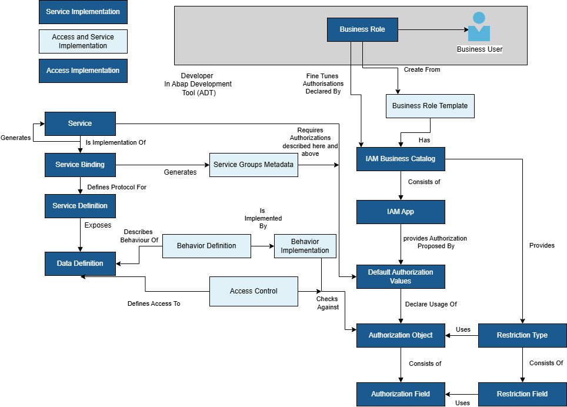

# Add Authentication and Role-Based Authorization

## Overview

This section explains the different roles and authorization concepts that must be implemented in the ABAP RAP Partner Reference Application **Loyalty Hub**. The final aim is to have two different roles for the two personas as depicted in the table below.

| Persona       | Role Template Id | Description |
| --------------| -----------------| ----------- |
| Admin         | ZLH_EXT_BR_LOYALTYHUB_ADMIN | The admin is able to perform CRUD operations in the Loyalty Hub app. |
| Sold-to party | ZLH_EXT_BR_LOYALTYHUB       | The sold-to party has view-only access to the Loyalty Hub app.   |

## Implementation of Authorizations in the App

[Authorization Objects](https://help.sap.com/docs/abap-cloud/abap-development-tools-user-guide/defining-authorization-objects) in ABAP define user permissions, controlling access to functions in ABAP RAP applications on SAP BTP. They ensure security by checking users rights for specific tasks.

    

### Create an Authorization Object

1. Create a data element named **ZLH_USERTYPE** of type **CHAR**, length restriction to 6 characters, and description as `User Type`.
2. On ABAP development tools for Eclipse, right-click on **ABAP Package – ZPRA_LOYALTYHUB -> New -> Other ABAP Repository Object** and create a new authorization field named **ZLH_USER** and provide the data element **ZLH_USERTYPE**.
3. Create a new authorization object named **ZLOYLTYHUB**.
   - Provide the created authorization field **ZLH_USER** in the **Authorization Fields** section.
   - Set the authorization field to ACTVT with permitted activities – ‘01’(Create or generate), ‘02’ (Change), ‘03’ (Display), and ‘06’ (Delete).
4. Create a restriction field named **ZLH_USERTYPE** and provide the created authorization field **ZLH_USER**.
5. Create a restriction type named **ZLH_USERTYPE**. Provide the restriction field you've just created. Provide the authorization object you've just created.
6. It is required to mark authorization as C1 release, so it can be used in the BDEF extension.

### Create an IAM App

1. Create a new IAM app named **ZLOYALTYHUB_IAM_EXT** and provide *ZLOYALTYHUB_UI5R* in **Fiori Launchpad App Descr Item ID**. On the **Service** tab, provide the Loyalty Hub service **ZLOYALTYHUB_MANAGE_SB**.
2. In the **Authorizations** tab, provide the object **ZLOYLTYHUB** and choose **synchronize**. In the **Authorization/Field** section, add the  values from the table below.
    | Field    | Value(s) |
    | -------- | -------- |
    | ZLH_USER | Default  |
    | ACTVT    | Display  |

### Create a Business Catalog

1. Create a new business catalog named **ZLOYALTYHUB_BUS_CATALOG** and add the IAM app created above (**ZLOYALTYHUB_IAM_EXT**) on the **Apps** tab. 
2. On the **Restriction types** tab, insert **ZLH_USERTYPE**.

### Creating Business Roles and Assigning Business Users

1. Log on to SAP Fiori launchpad as **Administrator** and open the **Maintain Business Roles** app.
2. Choose **New** and provide **ZLH_EXT_BR_LOYALTYHUB_ADMIN** as **Business Role ID**. As **Business Role Description**, set **Loyalty Hub Admin Role**.
3. On the next screen, on the **Business Catalog** tab, choose **Add**.
4. In the popup, search for the created business catalog **ZLOYALTYHUB_BUS_CATALOG**, select the business catalog, and choose **OK**.
5. Add the business catalogs below to the same role.
    - **ZLH_CATEGORY_MAINT_BC** - To maintain Categories.
    - **ZLH_CATEGORY_UPDATE_JOB** - To set up jobs for updating categories.
5. In **Access Categories** section, set **Write, Read, Value Help** to *Restricted*. Set **Read, Value Help** and **Value Help** to *Unrestricted*.
6. Choose **Maintain Restrictions**. Set **Assigned Restriction Types** to *ZLH_USERTYPE*. Set **User Type** to *ADMIN*.
7. Similarly, create a new role named **ZLH_EXT_BR_LOYALTYHUB_USER** for sold-to party and provide the business catalog **ZLOYALTYHUB_BUS_CATALOG**.
8. In **Access Categories** section, set **Write, Read, Value Help** to *Restricted*. Set **Read, Value Help** and **Value Help** to *Unrestricted*.
9. Choose **Maintain Restrictions**. Set **Assigned Restriction Types** to *ZLH_USERTYPE*. Set **User Type** to *USER*.
10. Add the business users to the appropriate role.

