# Extending the User Interface of an Application

## Overview

In this tutorial, you learn how a user interface generated by RAP can be extended using SAP BAS.

As shown in the [Entity Relationship diagram](../README.md#entity-relationship-diagram), category is a child of membership and a grand child of business partner. The object page in the app displays all entities on a single page, including category details. Hence, the **Create** function for category is not enabled in the RAP framework. 

To overcome this and provide the **Create** button for the category facet, create an action under the business partner entity to create a category. Do not expose the button of the action. Extend the user interface to add a **Create** button in the category facet and to handle the buttons's on-press functionality, call the method of the action created in the business partner entity to cretae the category.

## Prerequisites

1. **SAP Business Application Studio (SAP BAS) is enabled**: Ensure SAP BAS is activated, and a Dev space is created for your development. For setup instructions, refer to [Enable SAP Business Application Studio](./11_Prepare_BTP_Account_BAS.md#enable-sap-business-application-studio).
2. **Destination to the SAP S/4HANA Cloud Public Edition system is created**: A destination to the SAP S/4HANA Cloud Public Edition system must be configured in your SAP BTP subaccount. For more information, see [Create HTTP Destination to SAP S/4HANA Cloud Public Edition System](./11_Prepare_BTP_Account_BAS.md#create-http-destination-to-sap-s4hana-cloud-public-edition-system).
3. **A project is created for the application**: A project is created in the BAS for the application. For more information, see [Create a Project in SAP Build](./11_Prepare_BTP_Account_BAS.md#create-a-project-in-sap-build).

## Add a Web Application with SAP Fiori Elements

1. Open your Dev space in SAP Build.

   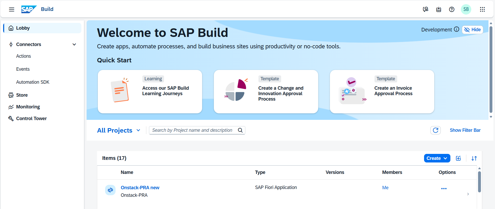

2. CHoose **File > New Project from Template**.
3. Choose **SAP Fiori generator** and choose **Start**.

   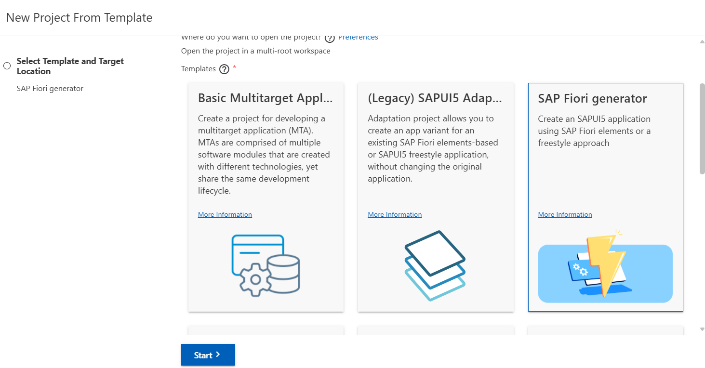

4. Select **List Report Page** and choose **Next**.

   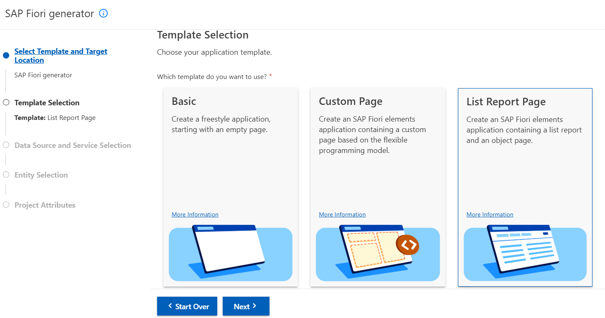

5. On the **Data Source and Service Selection** page, select the following values and choose **Next:**.
   - **Data Source**: Select **Connect to a System** from the dropdown.
   - **System**: Select the previously created destination to the SAP S/4HANA Cloud Public Edition system.
   - **Service**: Select the OData service of the **Loyalty Hub** app from the dropdown.

   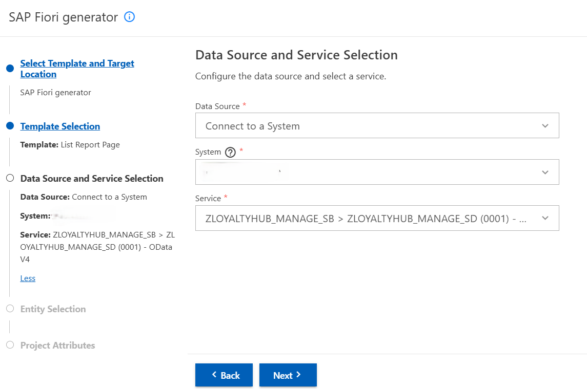

6. On the **Entity Selection** page, make sure `BusinessPartner` is selected as the main entity.
7. Retain the default values for other fields and choose **Next**.

   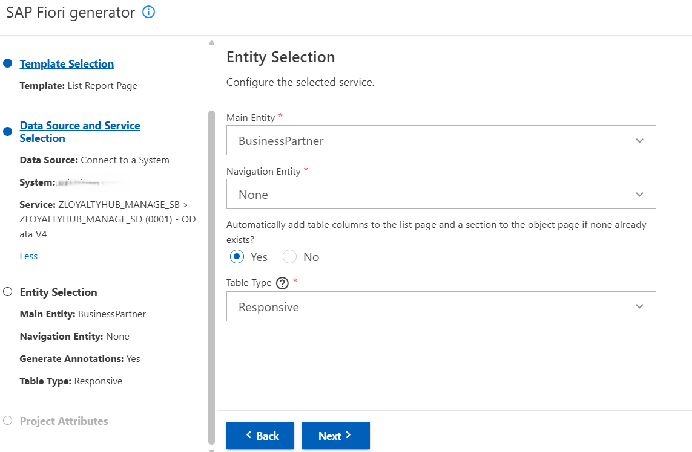

8. On the **Project Attributes** page, provide the following values and choose **Next**.
   - **Module Name**: loyaltyhub
   - **Application Title**: Manage Loyalty Hub
   - **Description**: An app to view and manage Loyalty Hub program
   - **Enable TypeScript**: No
   - **Add Deployment Configuration**: Yes
   - **Add SAP Fiori Launchpad Configuration**: No
   - **Use Virtual Endpoints for Local Preview**: Yes
   - **Configure Advanced Options**: No

   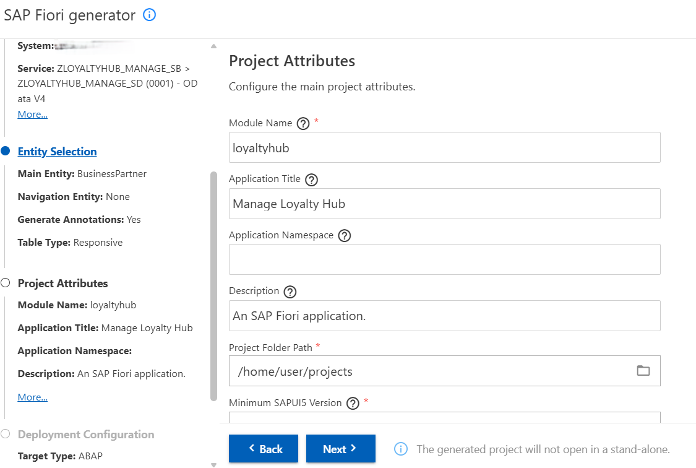

9. On the **Deployment Configuration** page, provide the following details and choose **Finish**.
   - **Please choose the target.**: ABAP
   - **Destination**: Same destination as used earlier
   - **SAPUI5 ABAP Repository**: ZLOYALTYHUB
   - Enter the package manually and provide `ZPRA_LOYALTYHUB` (name of the package where the app is present).
   - Enter the transport request manually and provide a workbench request from the back-end system.

   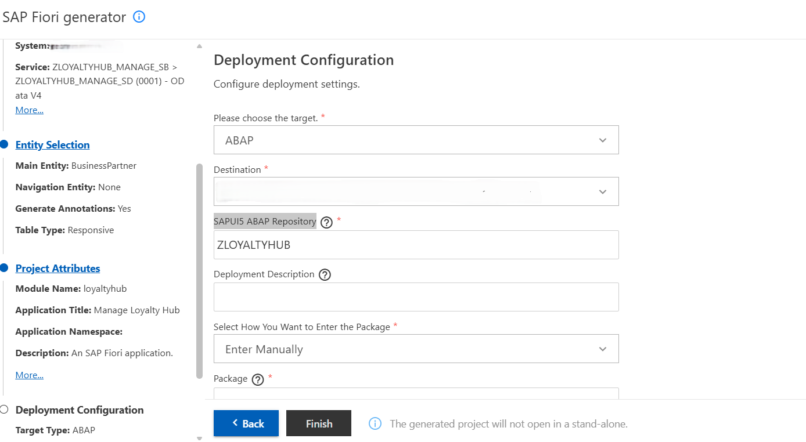

You have added the web application to the project folder and all the files and folders of the app should be visible in project explorer.

## Add a Create Button in the Category Facet in the Object Page

1. In the **Project Explorer**, add a new folder named **ext** in the path **fiori-apps > loyaltyhub > webapp**.
2. Inside the **ext** folder, create a new folder named **controller**. In the **controller** folder, cretae a JSON file named **controller.js**.
3. In the **controller** file, create a function named **fnCreateCategoryDialog**. This function handles the click event of the new **Create** button.
4. In the **Project Explorer**, right-click on the **webapp** folder and select **Show Page Map**.

   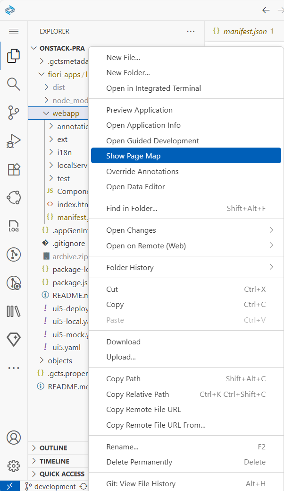

5. Choose **Configure Page** (pencil icon) on the object page.

   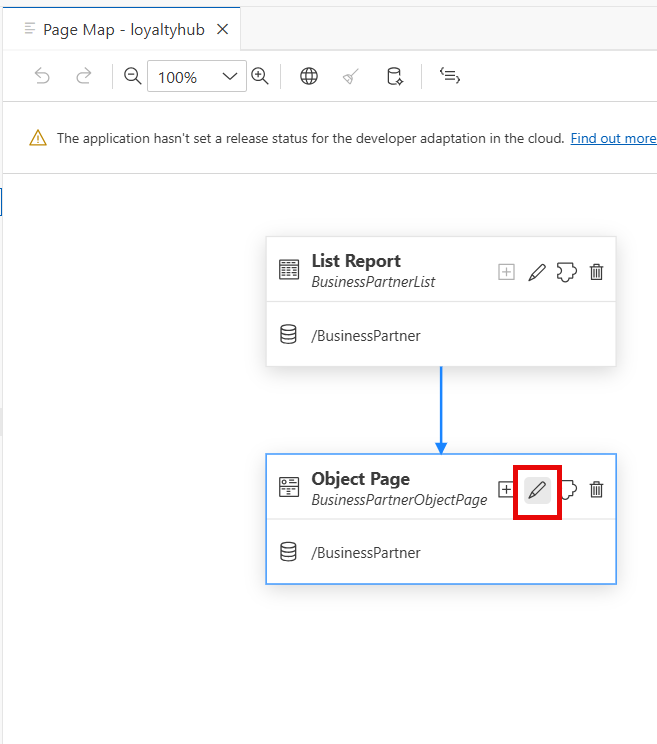

6. Under **Page Layout**, expand **Sections > Table > Tool Bar > Actions**.

   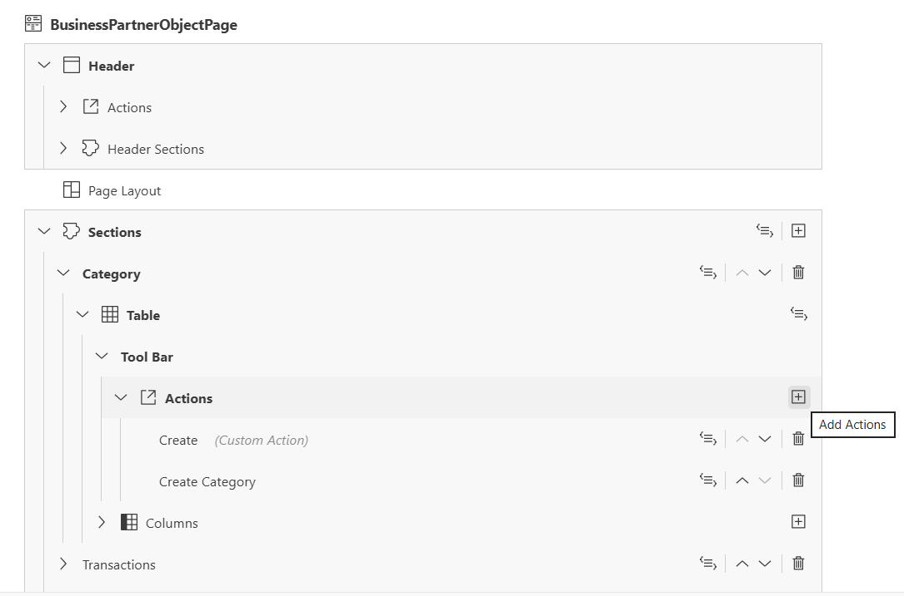

7. On **Actions**, choose **Add Actions** (plus icon) and choose **Add Custom Action**.

   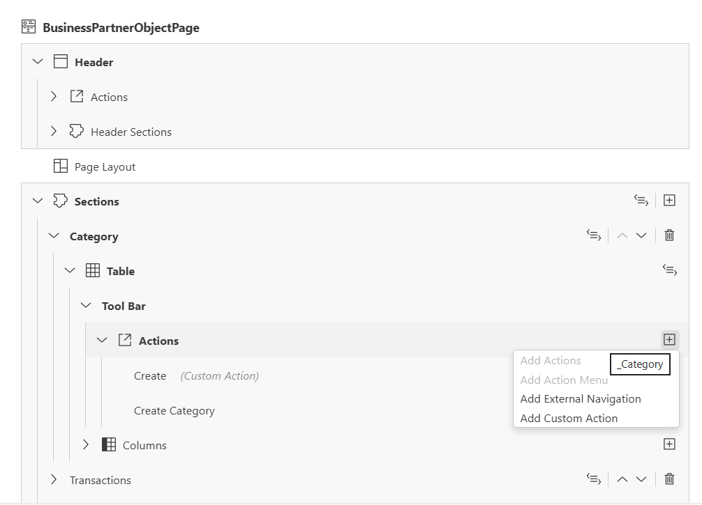

8. In the **New Custom Action** popup, provide the following details:
   - **Action ID**: categoryid
   - **Button Text**: Create
   - **Anchor**: Select the position where the button should be placed.
   - **Placement**: Select **Before** the provided anchor.
   - **Handler File**: Provide the path of the controller file created above from the dropdown.
   - **Handler Method**: fnCreateCategoryDialog (function created above in the controller file).

   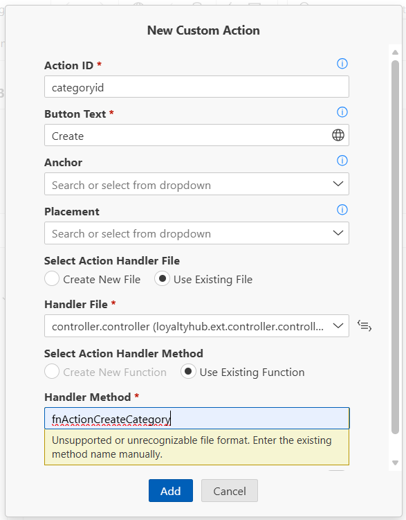

The code related to the new custom button is added in the manifest file.

## Create the Fragement for the Popup of the Button

1. In the **Project Explorer**, add a new folder named **View** in the path **fiori-apps > loyaltyhub > webapp > ext**.
2. In the folder, create a file named **CreateCategoryDialog.fragment.xml**, to create a fragment to be displayed as a popup when clicking the new custom button.
3. Add the code in the XML file. For details refer [CreateCategoryDialog](../fiori-apps/loyaltyhub/webapp/ext/View/CreateCategoryDialog.fragment.xml)
4. Inside the **ext->controller folder**, **controller.json** file is already created.
4. Add the code in the **controller** file to handle the click in the popup. For details refer [Controller](../fiori-apps/loyaltyhub/webapp/ext/controller/controller.js)

## Back-End Logic to Handle the Custom Button Functionality

1. Since Create button cannot be added in the Category facet through RAP, an action **createCategory** is created at the Business Partner level with a parameter.
2. The parameter will be an Abstract Entity with the fields to be provided as input in the action.For details of the Abstract Entity refer [ZLH_D_LHCREATECATEGORYP](../objects/DDLS/ZLH_D_LHCREATECATEGORYP/).
3. In the method of **createCategory** action, logic is written to create a category with the provided inputs. For more details refer [createCategory](../objects/CLAS/ZCL_LH_BUSINESSPARTNER/CINC%20ZCL_LH_BUSINESSPARTNER========CCIMP.abap)
4. The above method is called in the function of the **Create** button that is added on the UI. 
