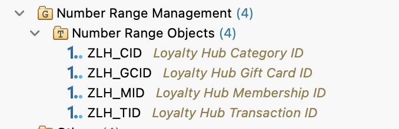

# Number Range Solution
## Overview 
Many business applications require unique numbers, for example, to complete the keys of data records. To generate these numbers, a number range object must be defined with specific properties and assigned one or more number range intervals. Unique numbers are then generated from the configured intervals.

### SAP Reference Help Documenatation:

- [Maintaining Number Range Objects](https://help.sap.com/docs/SAP_S4HANA_CLOUD/6aa39f1ac05441e5a23f484f31e477e7/bb50d4cb39b74801acdd440c91131034.html?version=2602.500)
- [Working with Number Range Objects](https://help.sap.com/docs/abap-cloud/abap-development-tools-user-guide/working-with-number-range-objects?version=sap_btp)
  
  
  
> [!NOTE]
> Creating, modifying, or deleting number range objects and intervals requires developer authorization. Additionally, changes can only be performed within the same software layer.

Number range objects have been created for all the key fields listed below, and each number range is assigned to its corresponding field domain.

### Configured Key Fields

| Business Object | Key Field | Number Range Object |
|----------------|----------|--------|
| Membership | Membership ID | ZLH_MID |
| Category | Category ID | ZLH_CID |
| Transaction | Transaction ID | ZLH_TID |
| Gift Card | Gift Card ID | ZLH_GCID |

    

