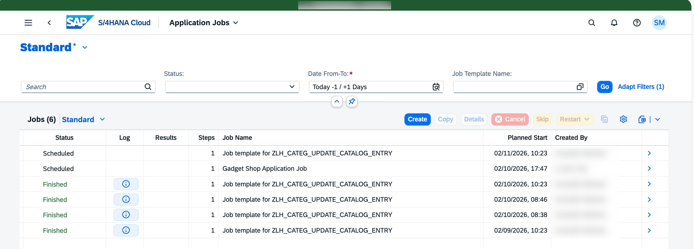
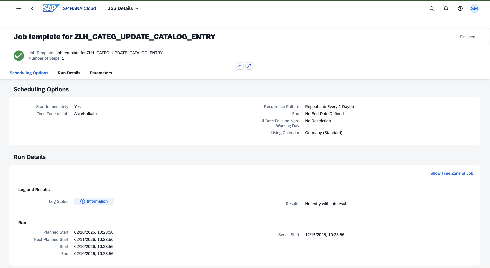
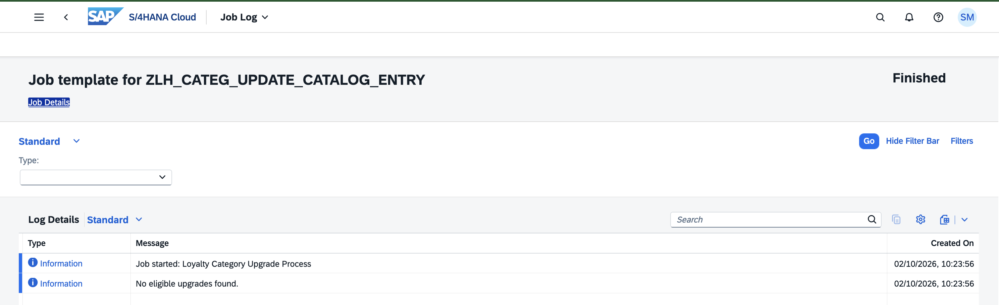
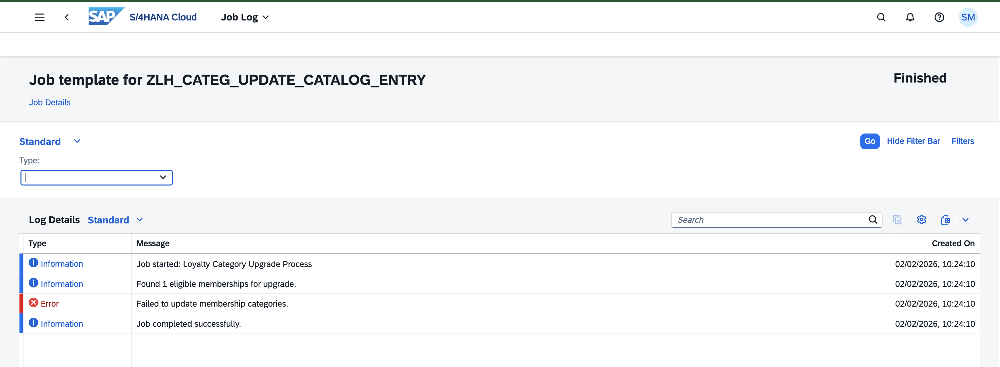
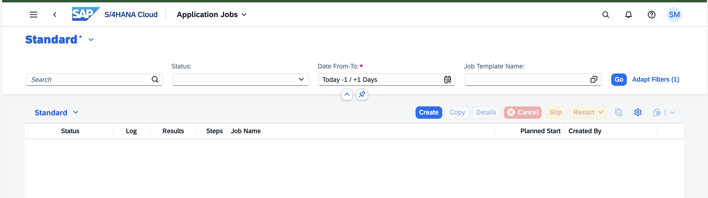
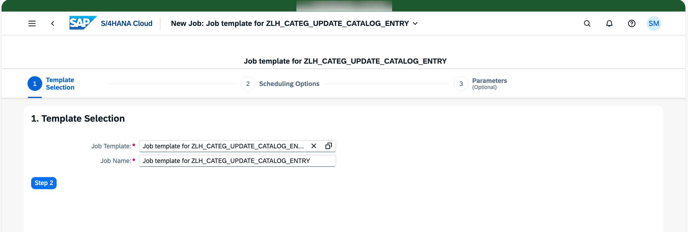
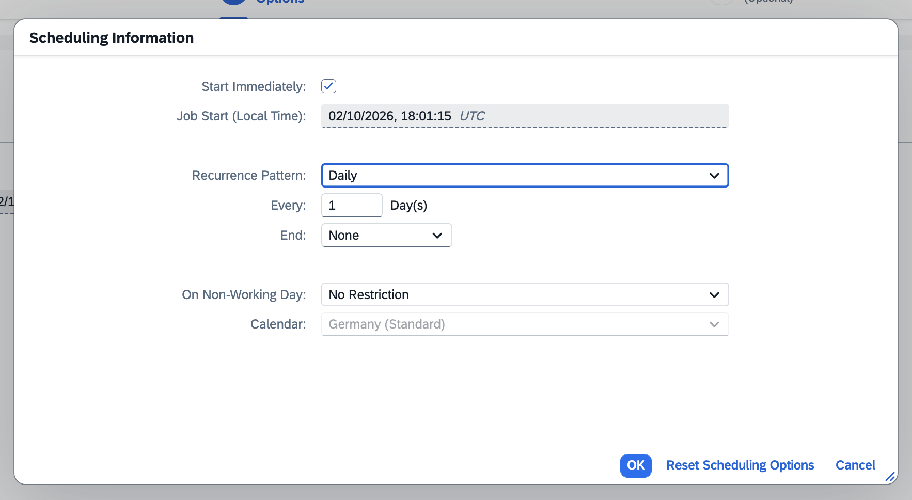
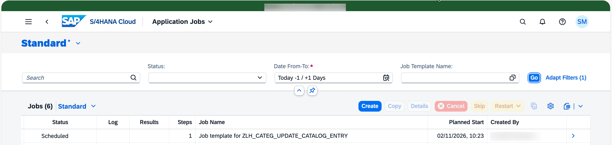
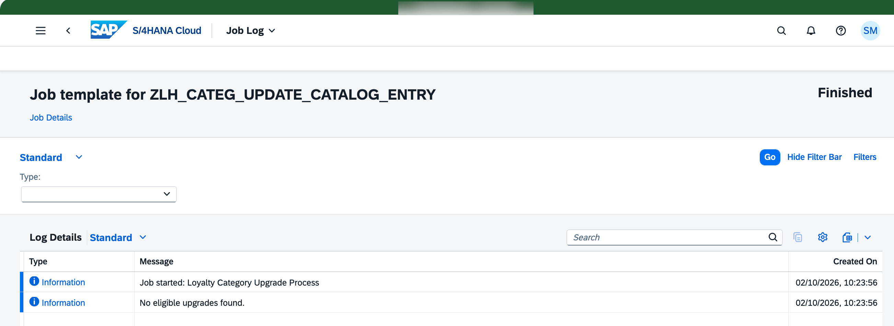

# Application Job for Category Update

## Overview

This tutorial provides a step-by-step guide to implement and understand an SAP S/4HANA **Application Job** that updates member categories based on accumulated loyalty points. It also explains how the job triggers **email notifications** to the respective members whenever a category upgrade occurs.

The job runs in the background and ensures that member categories remain aligned with the loyalty thresholds configured in the system.

---

## Introduction

The application job calculates the total loyalty points for each member and compares them against the maximum points defined per category in the **Maintain Loyalty Hub Categories** custom business configuration.

When a member’s accumulated points exceed the configured threshold:
- The member category is automatically upgraded
- An email notification is triggered for the upgraded member

This process is fully automated and executed using the SAP Application Job Framework.


  SAP Help Portal documentation: [Working with Application Jobs](https://help.sap.com/docs/abap-cloud/abap-development-tools-user-guide/working-with-application-job-objects).

---

#### List of Application Jobs
<p align="center">
    
</p>

#### Application Job Object Page

<p align="center">
    
</p>
<p align="center">
    
</p>
<p align="center">
    
</p>

## Application Job Technical Details 


### Objects Names

| Object Type | Name |
|------------|------|
| Application Job Catalog Entry | [`ZLH_CATEG_UPDATE_CATALOG_ENTRY`](../objects/SAJC/ZLH_CATEG_UPDATE_CATALOG_ENTRY) |
| Application Job Template | [`ZLH_CATEG_UPDATE_TEMPLATE`](../objects/SAJT/ZLH_CATEG_UPDATE_TEMPLATE) |
| IAM App | [`ZLH_CATEG_UPDATE_CATALOG_ENTRY_SAJC`](../objects/SIA6/ZLH_CATEG_UPDATE_CATALOG_ENTRY_SAJC) |
| Business Logic Class | [`ZCL_LH_CATEGORY_UPDATE_JOB`](../objects/CLAS/ZCL_LH_CATEGORY_UPDATE_JOB) |
| Runtime Interface | `IF_APJ_RT_RUN` |
| Business Catalog | [`ZLH_CATEGORY_UPDATE_JOB`](../objects/SIA1/ZLH_CATEGORY_UPDATE_JOB) |
| Application Log Object | [`ZLH_APPLICATION_LOG`](../objects/APLO/ZLH_APPLICATION_LOG) |

---

## Job Scheduling Support

### Prerequisites

- Required business role with business catalog.
- Users must be assigned this role to schedule and monitor the job.

---

### Scheduling the Application Job

1. Create a business role and assign the `ZLH_CATEGORY_UPDATE_JOB` business catalog.
2. Assign the required users to this role.
3. Open the **Application Jobs** app and choose **Create**.

<p align="center">
    
</p>

4. As template, select **ZLH_CATEG_UPDATE_TEMPLATE**.
   
<p align="center">
    
</p>

5. In step 2, define the recurrence pattern as **Daily**.

<p align="center">
    
</p>

6. Once the job is scheduled, check the list of jobs with their current status. You can also check the logs for each of the jobs to get information about:
   
- Category upgrades
- Email notifications
- Errors and warnings
  
<p align="center">
    
</p>   

<p align="center">
    
</p>   

---

## Application Job Implementation (ABAP)

This document explains how to implement an ABAP class that runs as an **application job**, create the required job catalog entry and job template, and configure the necessary authorizations.

### Implementing the Class that Runs as an Application Job

Business logic refers to the ABAP code that is executed within an application job. In addition to the execution logic, the business logic usually defines the data types and properties of the selection fields that appear on the selection screen before scheduling an application job.

In this context, the business logic is implemented in an **ABAP class**. The following development steps require a user with the appropriate **development role**.

#### Interface: IF_APJ_RT_RUN

To implement the business logic:

- Create an ABAP class that implements the interface:
  - `IF_APJ_RT_RUN`

In this class:
- Selection fields are defined as **public attributes**.
- These attributes are displayed as parameters on the job selection screen.

> **Recommendation:**  
> Use the `IF_APJ_RT_RUN` interface for all new application job developments.
> SAP Help Portal documentation: [Creating an ABAP Class with Interface IF_APJ_RT_RUN](https://help.sap.com/docs/sap-btp-abap-environment/abap-environment/creating-abap-class-with-interface-if-apj-rt-run?locale=en-US&state=PRODUCTION&version=Cloud).

#### EXECUTE Method

The `IF_APJ_RT_RUN` interface provides the following method:

- **`EXECUTE`**
  - Called by the Application Job Framework when the scheduled job runs
  - Contains the ABAP code that is executed as part of the application job

---

### Selection Parameters

Before scheduling an application job, a **selection screen** is displayed where users can enter values to control the processing of the business logic.

When the business logic is implemented in a class using `IF_APJ_RT_RUN`:

- Public class attributes are used as selection parameters
- Parameters must comply with the rules defined in:
  - [Defining Class Attributes Used as Selection Parameters](https://help.sap.com/docs/sap-btp-abap-environment/abap-environment/defining-class-attributes-used-as-selection-parameters?locale=en-US&state=PRODUCTION&version=Cloud)
- The data type of the class attribute determines how the parameter is displayed and behaves on the selection screen.

Before the `EXECUTE` method is called during job execution, the Application Job Framework automatically fills the class attributes with the values entered on the selection screen. These attributes can be used directly in the class logic without additional preparation.

---

### Business Logic Implementation Reference

The required business logic has been implemented in the following ABAP class: 

ZCL_LH_CATEGORY_UPDATE_JOB
```abap
  METHOD if_apj_rt_run~execute.

    init_log( ).
    add_log_msg( 'Job started: Loyalty Category Upgrade Process' ).

    " Process and determine upgrades
    DATA(upgrades) = process_category_upgrades( ).

    IF upgrades IS INITIAL.
      add_log_msg( 'No eligible upgrades found.' ).
      RETURN.
    ENDIF.

    add_log_msg( |Found { lines( upgrades ) } eligible memberships for upgrade.| ).

    " Create new categories
    create_new_categories( upgrades ).

    " Send email notifications
    send_notifications( upgrades ).

    add_log_msg( 'Job completed successfully.' ).

  ENDMETHOD.
```

---

### Creating the Job Catalog Entry

After implementing the ABAP class, a **Job Catalog Entry** must be created.

An application job catalog entry contains:
- The name of the ABAP class that implements the business logic
- Information about how selection fields are rendered in the scheduling dialog
- Additional settings required for scheduling and execution

You can create a job catalog entry using:

- **ABAP development tools for Eclipse (ADT)**
  - Refer to: [Working with Application Job Catalog Entries](https://help.sap.com/docs/abap-cloud/abap-development-tools-user-guide/working-with-application-job-catalogs?version=sap_btp)


### Creating the Job Template

An **application job template** refers to an application job catalog entry and contains values for some or all selection fields.

- A job template can be considered a variant of a job catalog entry.
- It may:
  - Contain no values (initial values are used)
  - Contain partial or full parameter values
- A job catalog entry can have **multiple job templates**.

Job templates can be created using:

- **ABAP development tools for Eclipse (ADT)**
  - Refer to: [Working with Application Job Templates](https://help.sap.com/docs/abap-cloud/abap-development-tools-user-guide/working-with-application-job-templates?version=sap_btp)

---

### Setting Up the Authorizations

Some further activities in ABAP development tools for Eclipse and in the administrator’s launchpad are necessary to be able to schedule the job template in the **Application Jobs** app.
You can follow mentioned steps in [Setting up the Authorizations](https://help.sap.com/docs/sap-btp-abap-environment/abap-environment/setting-up-authorizations?locale=en-US&state=PRODUCTION&version=Cloud).

### Setting Up Email Notification

You can refer to the detailed steps for implementing email notifications in [Email Notification](./43_Email_Notification_Category_Update.md). 
