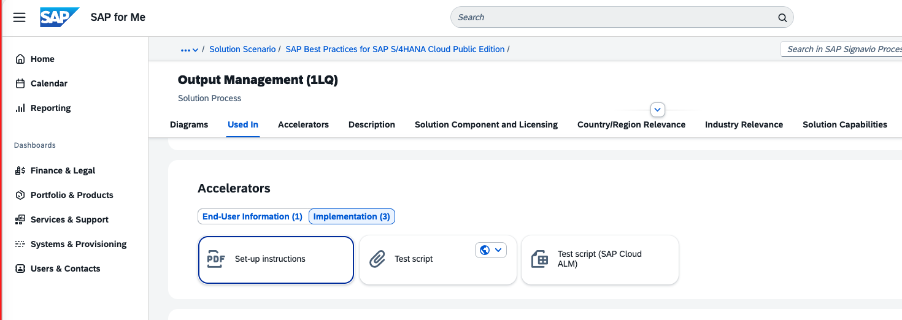
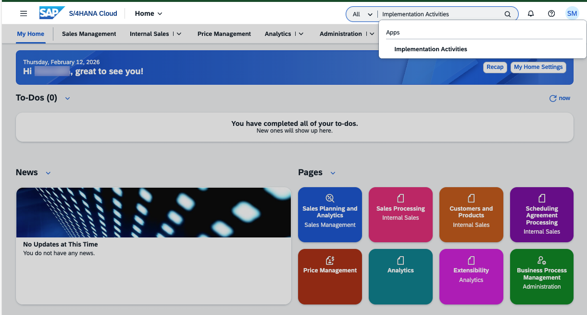
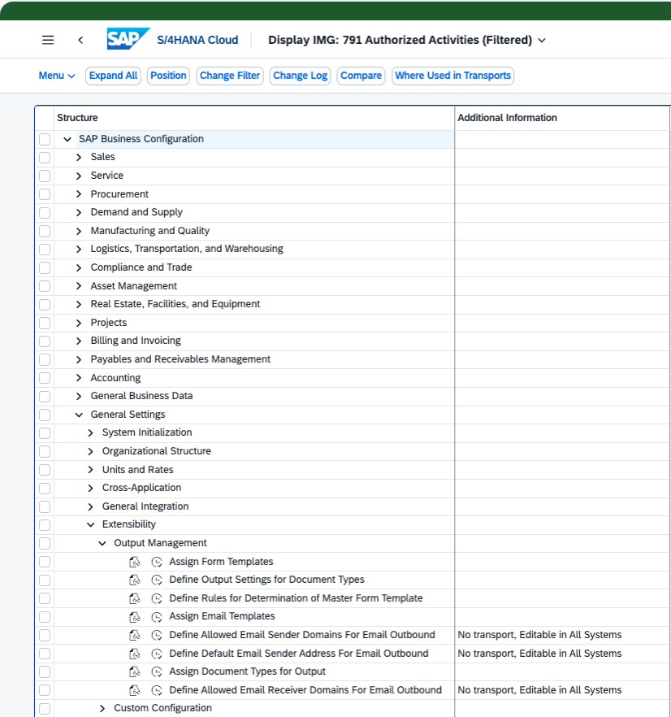

# Send Email Notifications on Category Upgrade

## Overview

This tutorial provides a step-by-step guide to implement and understand the **email notification functionality** used to notify members when their category is updated through an **application job**.

The email notification is triggered automatically when a member’s category is upgraded as part of the background job execution.

---

## Email Notification Implementation

### Sender Email Configuration

- By default, the sender email address is:
do.not.reply@my300000.mail.s4hana.ondemand.com

- If you want to configure a **custom sender email address**, follow the SAP roadmap and set up **DKIM** configuration. For that, open solution process Output Management (1LQ) on [SAP Signavio Process Navigator](https://me.sap.com/processnavigator/SolP/1LQ) and go to the setup instructions. Check the section 4.2 in the pdf for information about setting up email.

    

---

### Define Allowed Receiver Email Domains

To ensure email notifications are delivered successfully, it is **mandatory** to define allowed receiver email domains.

### Steps

1. Open the **Implementation Activities** app.
   

    
   

2. Navigate to the following configuration path:
   

    
   

- Choose **Define Allowed Email Receiver Domain for Email Outbound** and maintain the list of permitted recipient email addresses.
Email notifications are sent only to the addresses defined here.
- To allow notifications to be sent to all email domains, maintain the value as *.
Maintaining the allowed receiver email address is **mandatory** for email notification to work.

---

## Implementation of Send Notification

- [SAP Help Portal documentation](https://help.sap.com/docs/SAP_S4HANA_CLOUD/6aa39f1ac05441e5a23f484f31e477e7/8d1f989deca1455dabc3d81b433fbdaf.html?version=2602.500)

The logic for sending email notifications during category updates is implemented as part of the application job.

## Technical Implementation Details

- **ABAP Class Name**: [ZCL_LH_CATEGORY_UPDATE_JOB](../objects/CLAS/ZCL_LH_CATEGORY_UPDATE_JOB)
